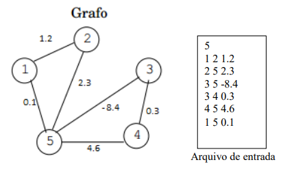
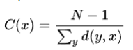

# Especificações do Trabalho Prático

### Utilizar __Lista de Adjacência__

### Requisitos
- ~~Retornar a ordem do grafo~~
- ~~Retornar o tamanho do grafo~~
- ~~Retornar os vizinhos de um vértice fornecido~~
- ~~Determinar o grau de um vértice fornecido~~
- ~~Retornar a sequência de graus do grafo~~
- ~~Determinar a excentricidade de um vértice~~
- ~~Determinar o raio do grafo~~
- ~~Determinar o diâmetro do grafo~~
- ~~Determinar o centro do grafo~~
- ~~Determinar a sequência de vértices visitados na busca em profundidade e
informar a(s) aresta(s) que não faz(em) parte da árvore de busca em profundidade.~~
- ~~Determinar distância e caminho mínimo~~
- ~~Determinar a centralidade de proximidade C de um vértice x, dada por~~

Onde N é o número de vértices do grafo e d(y,x) é a distância entre os vértices x e
y. Esta medida é conhecida na área de redes sociais e refere-se a distância média de x a
um vértice qualquer do grafo.
- ~~Por fim, em https://paad-grafos.herokuapp.com pode-se salvar o grafo num
arquivo .json. Assim deve-se implementar uma rotina que leia o arquivo .json e o coloque
no formato de entrada exigido pelo arquivo de entrada deste trabalho. Além disso, devese implementar uma rotina que pegue um arquivo texto no formato de entrada exigido
neste trabalho e gere o arquivo .json de modo que seja importado para o https://paadgrafos.herokuapp.com~~

